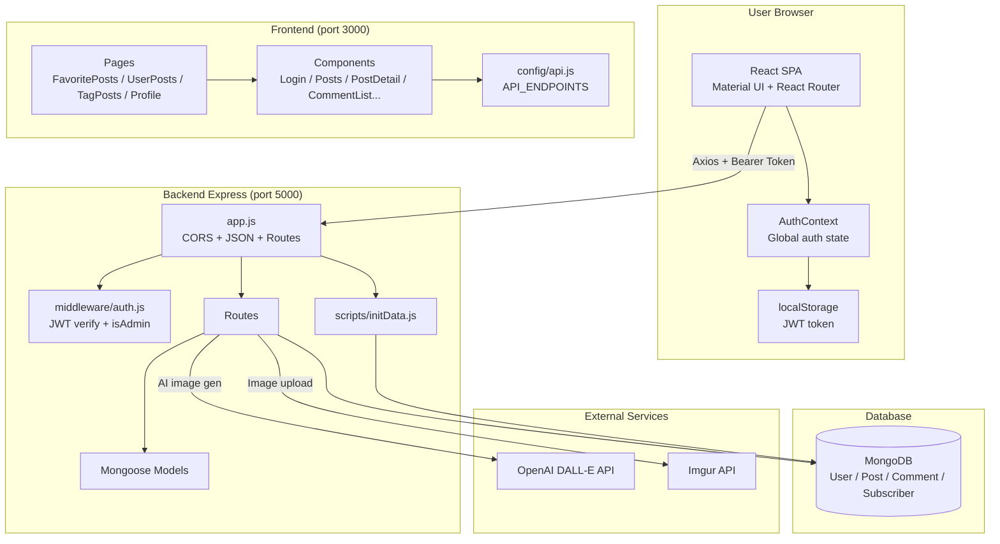
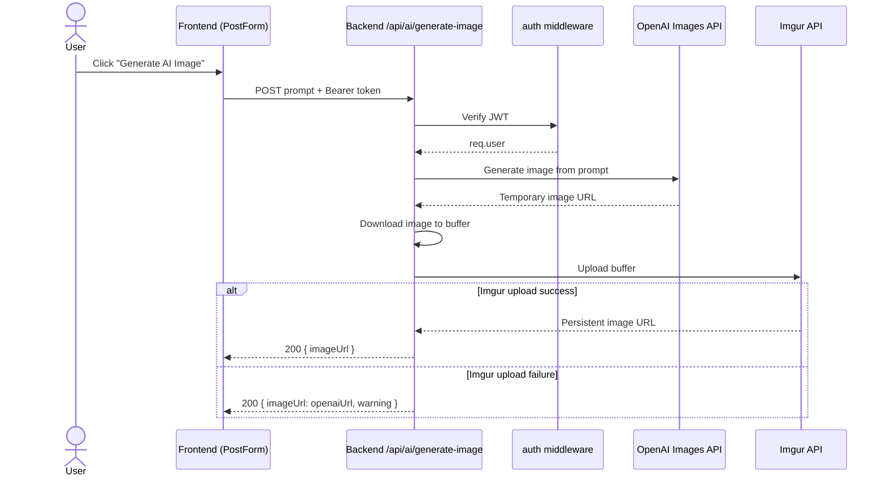

# Wordwalker: Your Personal Content Publishing Platform

**Wordwalker** is a full-stack MERN (MongoDB, Express.js, React, Node.js) blog application designed as a personal content publishing hub. A standout feature is the ability for users to **automatically generate striking images for their articles using AI**, enhancing their content effortlessly. It emphasizes a "creator-centric, reader-focused" model where content creation and overall site management are primarily handled by an administrator, while registered users can manage their own contributions and personalize their reading experience.

Users can enjoy a seamless reading experience, save their favorite articles, manage their profiles, and publish their own posts. 


## Live Demo

*   **Demo URL:** [https://myblogpost-frontend-static-site.onrender.com/](https://myblogpost-frontend-static-site.onrender.com/)

### Default Users

Use these accounts to try the demo (created when the app runs `backend/scripts/initData.js` on startup):


1.  **Admin User**
    *   Email: `admin@example.com`
    *   Password: `admin123`
    *   Role: `admin`

2.  **Regular User**
    *   Email: `user@example.com`
    *   Password: `user123`
    *   Role: `user`

Note: I am currently using a free-tier database and server, so the initial login may take a little longer than expected.

 

 

 

 

## Key Features

*   **User Authentication & Authorization:**
    *   Secure user registration and login using JSON Web Tokens (JWT).
    *   Role-based access control (Admin, User).
*   **Content Creation & Management:**
    *   **For All Users:**
        *   Create, read, update, and delete their own blog posts.
        *   Dedicated "My Posts" page for managing personal articles.
    *   **Admin Privileges:**
        *   Full CRUD (Create, Read, Update, Delete) operations on all articles across the platform.
        *   Access to manage all comments and subscriber data.
    *   **Post Features:**
        *   Rich text content support for articles.
        *   Tagging system for content categorization.
        *   **AI-Powered Image Generation:** Users can generate a featured image for their post based on the title using OpenAI's DALL-E. The generated image is then automatically uploaded to Imgur for a persistent URL, which is stored with the post.
*   **User Experience & Engagement:**
    *   **Favorite Posts:** Logged-in users can bookmark/unbookmark articles and view their personalized list of favorites.
    *   **Public Article Browsing:** All visitors can browse the list of public articles and view individual post details.
    *   **Responsive Design:** Optimized for a seamless experience across desktops, tablets, and mobile devices.
    *   **Modern UI:** Clean and intuitive user interface built with Material UI.

## Technology Stack

*   **Frontend:**
    *   React (v18+)
    *   Material UI (MUI v5)
    *   React Router DOM (v6) for navigation
    *   Axios for API communication
    *   React Context API for global state management
*   **Backend:**
    *   Node.js (v18+, locked via `engines` / `.nvmrc`)
    *   Express.js framework (`app.js` for the Express app, `server.js` for startup / graceful shutdown)
    *   MongoDB with Mongoose ODM
    *   JSON Web Tokens (JWT) + `bcryptjs` for authentication
    *   Joi for request validation
    *   Helmet for HTTP security headers
    *   `express-rate-limit` for API / auth rate limiting
    *   Winston for structured logging (stdout)
    *   Centralized config (`config/index.js`) via `dotenv`
    *   Axios + `form-data` for OpenAI / Imgur integrations
    *   ESLint (`eslint-plugin-n`) for linting
*   **Database:**
    *   MongoDB Atlas (cloud-hosted NoSQL database) or a local MongoDB instance.
*   **Image Services:**
    *   OpenAI Images API for AI image generation.
    *   Imgur API for image hosting and storage.

## System Overview

High-level view of how the browser, frontend, backend, database, and external services connect.



### Layers

| Layer | Technology | Responsibility |
|-------|------------|----------------|
| **Client** | React SPA + AuthContext + localStorage | UI, routing, JWT persistence in the browser |
| **Frontend** | React, MUI, Axios, `config/api.js` | Pages/components; calls backend with `Authorization: Bearer <token>` |
| **Backend** | Express, Mongoose, JWT middleware | REST API, auth, business logic, secrets (API keys) |
| **Database** | MongoDB | Users, posts, comments, subscribers |
| **External** | OpenAI + Imgur | AI featured images; permanent image URLs on posts |

### Request Flow Examples

**Login**

```
Browser → POST /api/auth/login → verify password (bcrypt) → JWT → localStorage + AuthContext
```

**Read a post**

```
Browser → GET /api/posts/:id → Express → Mongoose → MongoDB → JSON → React (PostDetail)
```

**Create post with AI image (authenticated)**

```
Browser (JWT) → POST /api/ai/generate-image → OpenAI → download → Imgur → imageUrl
Browser (JWT) → POST /api/posts { title, content, imageUrl } → save to MongoDB
```

The browser never talks to MongoDB or external APIs directly; only the Express server does, keeping credentials on the server.

### AI Image Generation Flow

This sequence shows how a user generates an AI featured image and how the backend handles the Imgur fallback.



### Architecture Docs

- See [`docs/architecture/README.md`](docs/architecture/README.md) for system overview and frontend/backend architecture diagrams.


## Prerequisites

Before you begin, ensure you have the following installed:

*   Node.js (v18 or higher recommended)
*   npm (comes with Node.js) or yarn
*   MongoDB (if running a local database instance)


## Installation & Setup

1.  **Clone the Repository:**
    ```bash
    git clone https://github.com/MagicDogGuo/MyBlogPost.git
    cd blog-post
    ```

2.  **Install Backend Dependencies:**
    ```bash
    cd backend
    npm install
    ```

3.  **Install Frontend Dependencies:**
    ```bash
    cd ../frontend
    npm install
    ```

4.  **Configure Environment Variables:**

    *   **Backend (`backend/.env`):**
        Create a `.env` file in the `backend` directory with the following content:
        ```env
        MONGODB_URI=your_mongodb_connection_string # e.g., mongodb://localhost:27017/wordwalker or your Atlas connection string
        PORT=5000
        JWT_SECRET=your_long_random_secret # Required — used to sign/verify JWTs

        # OpenAI API Key (for AI image generation)
        OPENAI_API_KEY=your_openai_api_key # Get this from the OpenAI Platform

        # Imgur Client ID (for uploading AI-generated images to Imgur)
        IMGUR_CLIENT_ID=your_imgur_client_id # Register an application on Imgur to get this
        ```
        See `backend/env.example` for the full list of optional variables (`CLIENT_URL`, `LOG_LEVEL`, rate-limit settings, etc.).
        *   **Obtaining `OPENAI_API_KEY`**: Visit the [OpenAI Platform](https://platform.openai.com/account/api-keys) to create your API key.
        *   **Obtaining `IMGUR_CLIENT_ID`**: Register your application on the [Imgur API Documentation page](https://apidocs.imgur.com/#registerapp). Choose anonymous usage type; an OAuth2 callback URL is not required for this functionality.

    *   **Frontend (`frontend/.env`):**
        Create a `.env` file in the `frontend` directory with the following content:
        ```env
        REACT_APP_API_URL=http://localhost:5000/api # Base URL for your backend API
        ```

## Running the Application

1.  **Start the Backend Server:**
    ```bash
    cd backend
    npm start
    ```
    The backend server will run on `http://localhost:5000` (or the `PORT` specified in your `.env` file).

2.  **Start the Frontend Development Server:**
    (In a new terminal window)
    ```bash
    cd frontend
    npm start
    ```
    The frontend application will run on `http://localhost:3000` and should open automatically in your browser.

## Project Structure

```
wordwalker/
├── backend/
│   ├── config/         # Configuration files (e.g., database connection)
│   ├── middleware/     # Express middleware (e.g., auth, error handling)
│   ├── models/         # Mongoose data models (User, Post, Comment, etc.)
│   ├── routes/         # API route definitions
│   ├── scripts/        # Initialization scripts (e.g., default data)
│   └── app.js          # Express application entry point and main configuration
├── frontend/
│   ├── public/     # Static assets (index.html, favicon, images)
│   ├── src/
│   │   ├── assets/       # Image, font resources
│   │   ├── components/   # React components
│   │   ├── config/       # Frontend configuration (e.g., API endpoints)
│   │   ├── context/      # React Context API (e.g., AuthContext)
│   │   ├── hooks/        # Custom React Hooks
│   │   ├── pages/        # Page-level components
│   │   ├── services/     # API service wrappers
│   │   ├── styles/       # Global styles, theme configuration
│   │   ├── utils/        # Utility functions
│   │   ├── App.js        # Root React component and router setup
│   │   └── index.js      # React application entry point
│   └── package.json
└── README.md
```

## API Endpoints (Key Functionalities)

### Authentication (Auth)
*   `POST /api/auth/register` - Register a new user
*   `POST /api/auth/login` - Log in an existing user
*   `GET /api/auth/me` - Get current logged-in user's information (Token required)

### Posts (Articles)
*   `GET /api/posts` - Fetch all public posts (supports pagination, filtering via query params)
*   `GET /api/posts/me/myposts` - Fetch all posts by the currently logged-in user (Token required)
*   `GET /api/posts/:id` - Fetch details of a single post
*   `POST /api/posts` - Create a new post (Token required; users create their own, admin can create any)
*   `PUT /api/posts/:id` - Update an existing post (Token required; users can only update their own posts, admin can update any)
*   `DELETE /api/posts/:id` - Delete a post (Token required; users can only delete their own posts, admin can delete any)
*   `POST /api/posts/:id/like` - Like/Unlike a post (Token required)
*   `GET /api/posts/user/:userId` - Fetch all posts by a specific user ID

### Comments (Assumed implemented or planned)
*   `POST /api/posts/:postId/comments` - Add a comment to a post (Token required)
*   `GET /api/posts/:postId/comments` - Fetch all comments for a post
*   `PUT /api/comments/:commentId` - Update a comment (Token required; commenter or admin)
*   `DELETE /api/comments/:commentId` - Delete a comment (Token required; commenter or admin)

### AI Image Generation
*   `POST /api/ai/generate-image` - Generate an image based on a prompt and upload to Imgur (Token required)

## License

This project is licensed under the MIT License - see the `LICENSE` file for details.


