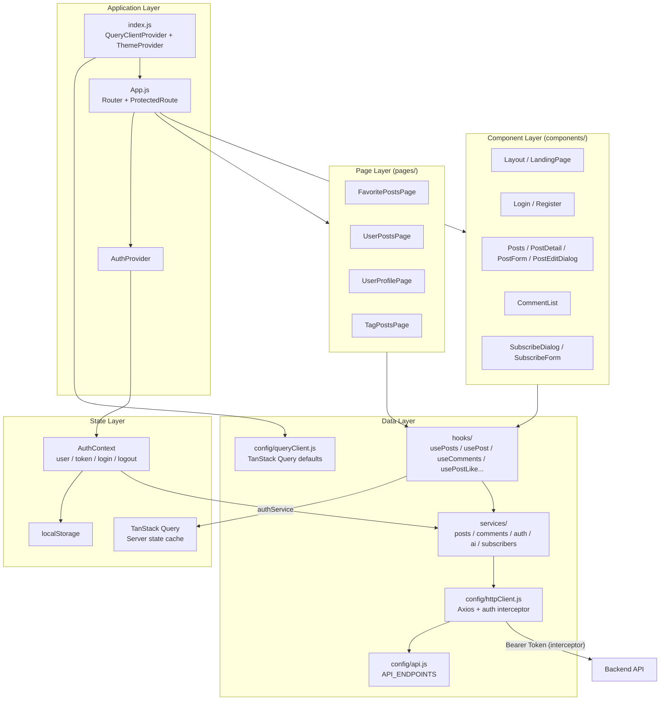

# Frontend Architecture

Structure of the React single-page application (SPA) under `frontend/`.

## Layered architecture



## Directory roles

| Path | Role |
|------|------|
| `src/index.js` | Entry: wraps app with `QueryClientProvider` + MUI `ThemeProvider` |
| `src/App.js` | Root router, `ProtectedRoute`, route definitions |
| `src/context/AuthContext.js` | Client auth state; login/register/logout via `authService`; token restore via `/api/auth/me` |
| `src/config/api.js` | Base URL (`REACT_APP_API_URL`) and endpoint constants |
| `src/config/httpClient.js` | Shared Axios instance; request interceptor attaches JWT from `localStorage`; 401 clears token |
| `src/config/queryClient.js` | Shared TanStack Query client (e.g. `staleTime`, retry) |
| `src/services/` | Thin API wrappers returning `response.data` (`posts`, `comments`, `auth`, `ai`, `subscribers`) |
| `src/hooks/` | `useQuery` / `useMutation` hooks + `queryKeys.js`; UI should call hooks, not services directly |
| `src/pages/` | Route-level screens (favorites, my posts, profile, tag browse) |
| `src/components/` | Reusable UI (posts, comments, login, layout, post form / edit dialog) |
| `src/theme.js` | Material UI theme |

## Data flow

```
UI (page/component)
  → hooks (usePosts / usePost / useComments / …)
    → services (postsService / …)
      → httpClient (+ Bearer from localStorage)
        → Backend REST API
```

- **Server state** (posts, comments, tags, favorites): TanStack Query — cache, loading/error, invalidation after mutations.
- **Client auth state** (current user / token): `AuthContext` + `localStorage`.
- Components should **not** import `axios` or attach `Authorization` headers manually; only `httpClient` does that.

## Main hooks

| Hook | Purpose |
|------|---------|
| `usePosts` / `useCreatePost` / `useUpdatePost` / `useDeletePost` | Post list + CRUD mutations (invalidate `['posts']`) |
| `usePost(id)` | Single post detail |
| `usePostLike(post, user)` | Shared optimistic like/unlike (used by `PostList` and `PostDetail`) |
| `useLikePost(id)` | Like mutation only |
| `useMyFavoritePosts` / `useMyPosts` | Current user's favorites / own posts |
| `usePostsByTag` / `useUniqueTags` | Tag browse |
| `useComments` / `useCreateComment` / `useDeleteComment` | Comments for a post |
| `useSubscribe` | Newsletter subscribe |
| `useGeneratePostImage` | AI cover image |
| `useUpdateProfile` | Profile username update |

## Routing

| Route | Access | Page / component |
|-------|--------|------------------|
| `/` | Public | LandingPage |
| `/login`, `/register` | Public | Login, Register |
| `/posts`, `/posts/:id` | Protected | Posts, PostDetail |
| `/favorites` | Protected | FavoritePostsPage |
| `/my-posts` | Protected | UserPostsPage |
| `/profile` | Protected | UserProfilePage |
| `/tags/:tagName` | Public | TagPostsPage |

`ProtectedRoute` checks `AuthContext.user`; unauthenticated users are redirected to `/login`.

## Authentication flow

1. **Login:** `authService.loginRequest` → `POST /api/auth/login` → store JWT in `localStorage` → update `AuthContext` (`user`, `token`).
2. **App load:** If token exists → `authService.fetchCurrentUser` → `GET /api/auth/me` (Bearer via interceptor) → restore user or clear invalid token.
3. **API calls:** `httpClient` request interceptor reads `localStorage.token` and sets `Authorization: Bearer <token>`. On `401`, the response interceptor removes the token.

## Key feature touchpoints

| Feature | Main files |
|---------|------------|
| Post CRUD | `hooks/usePosts.js`, `Posts.js`, `UserPostsPage.js`, `PostForm.js`, `PostEditDialog.js` |
| Post detail | `hooks/usePost.js`, `PostDetail.js` |
| Like | `hooks/usePostLike.js`, `PostList.js`, `PostDetail.js` |
| Tags | `hooks/usePostsByTag.js`, `TagPostsPage.js`, `RecommendedTopics.js` |
| Comments | `hooks/useComments.js`, `CommentList.js` on `PostDetail` |
| AI cover image | `hooks/useGeneratePostImage.js`, `PostForm.js` → `aiService` |
| Favorites | `hooks/useMyFavoritePosts.js`, `FavoritePostsPage.js` |
| Newsletter | `hooks/useSubscribe.js`, `SubscribeDialog.js` / `SubscribeForm.js` |

## Environment

```env
REACT_APP_API_URL=http://localhost:5000/api
```

Production builds point this to the deployed backend API URL.

## Related pages

- [System Overview](System-Overview.md)
- [Backend Architecture](Backend-Architecture.md)
