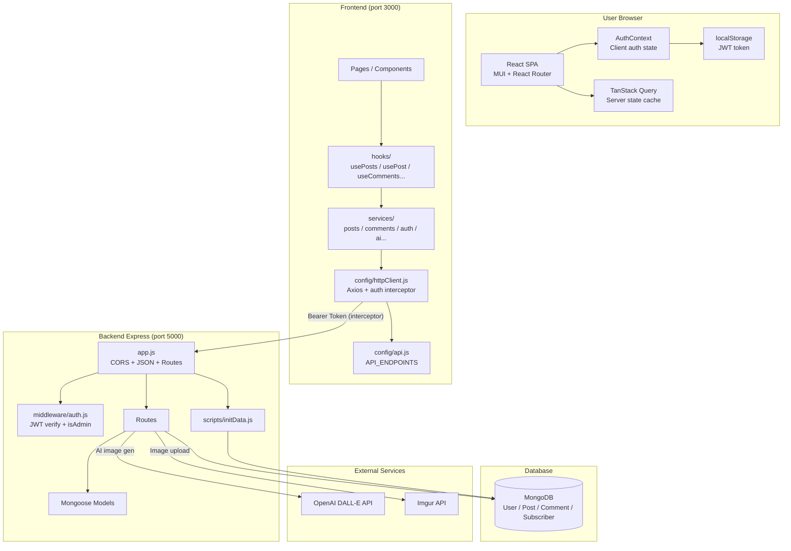

# System Overview

High-level view of how the browser, frontend, backend, database, and external services connect in **Wordwalker**.

## Architecture diagram



## Layers

| Layer | Technology | Responsibility |
|-------|------------|----------------|
| **Client** | React SPA + AuthContext + TanStack Query + localStorage | UI, routing, auth state, server-state cache |
| **Frontend** | MUI, hooks, services, `httpClient`, `config/api.js` | Components call hooks → services → shared Axios instance (JWT attached automatically) |
| **Backend** | Express, Mongoose, JWT middleware | REST API, authorization, business logic, API secrets |
| **Database** | MongoDB | Users, posts, comments, subscribers |
| **External** | OpenAI + Imgur | AI cover images; stable public image URLs on posts |

## Request flow examples

### Login

```
Browser → authService.loginRequest → POST /api/auth/login → JWT → localStorage + AuthContext
(subsequent API calls: httpClient interceptor reads token from localStorage)
```

### Read a post

```
PostDetail → usePost(id) → postsService.getPost → httpClient → GET /api/posts/:id → MongoDB → TanStack Query cache
```

### Create post with AI image (authenticated)

```
PostForm → useGeneratePostImage → aiService → POST /api/ai/generate-image → OpenAI → Imgur → imageUrl
Posts / UserPosts → useCreatePost → postsService → POST /api/posts { title, content, imageUrl } → MongoDB
(query invalidation refreshes posts list / detail / my-posts caches)
```

## Security note

The browser **never** talks to MongoDB or external APIs (OpenAI, Imgur) directly. Only the Express server does, keeping credentials on the server. JWT is attached by `httpClient`'s request interceptor, not wired manually in each component.

## Related pages

- [Frontend Architecture](Frontend-Architecture.md)
- [Backend Architecture](Backend-Architecture.md)
